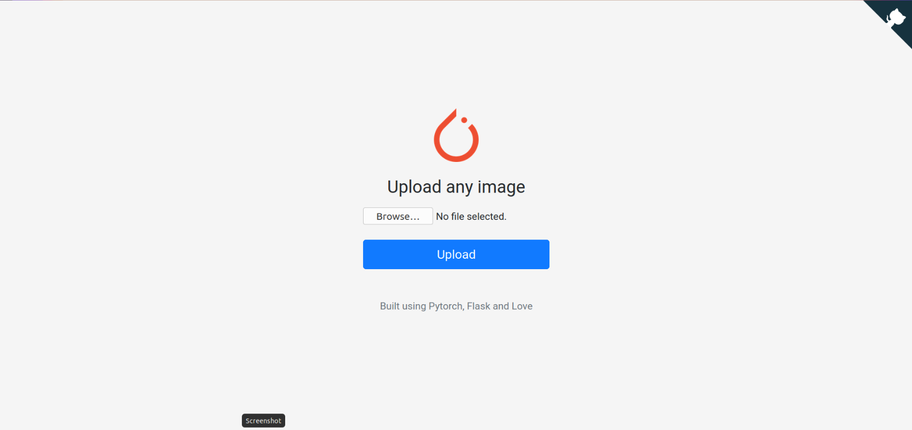
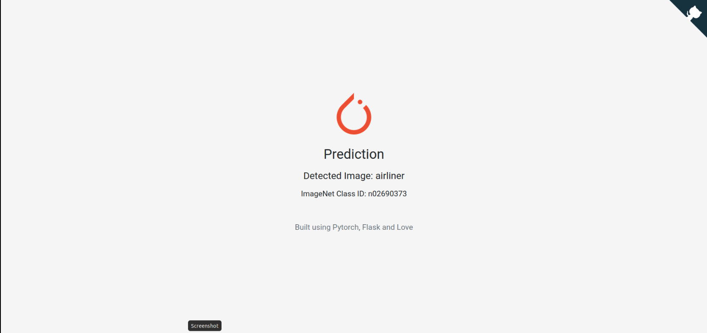

# ImagenetDetection
Using Pretrained Densenet 121 Model in the Pytorch library. 
Imagenet is a large scale dataset of objects with 1000 categories.

## Implemented on a local server
Main Landing Page



Upload an Image


Results



## Usage
Clone the Repository

`git clone https://github.com/sanketnagrale/ImagenetDetection`

Download the required libraries

`pip install -r requirements.txt`

Run the program

```
export FLASK_APP=main.py
flask run
```
